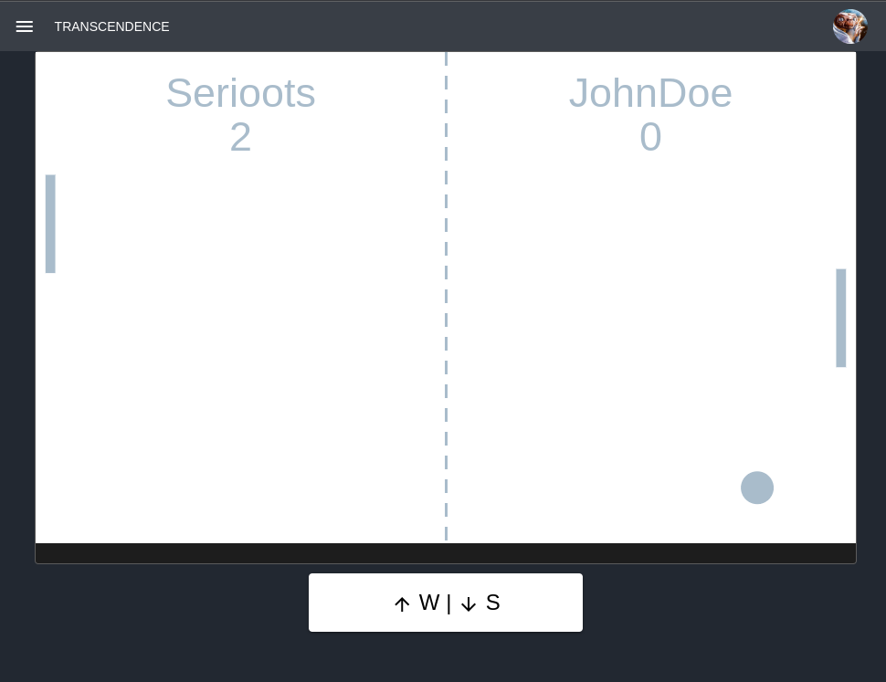
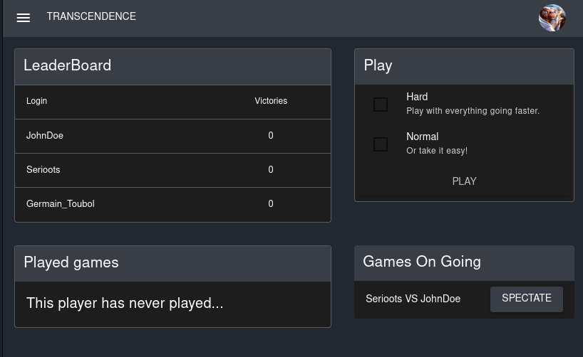
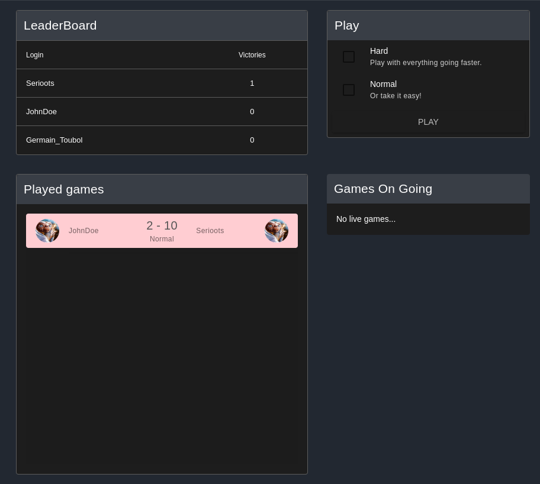
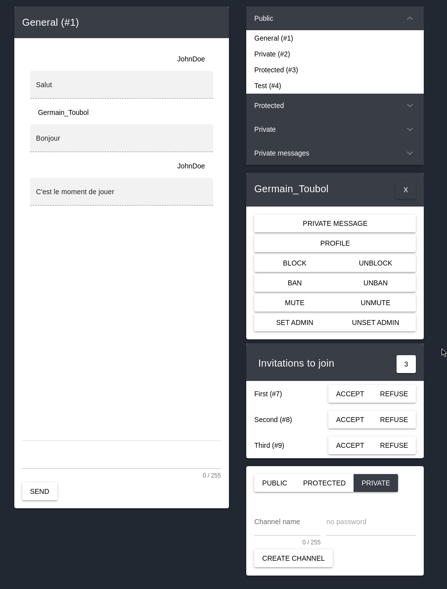

# ft_transcendence

## Rules
This school project aims to create a fully functionnal website, centered around
the pong game. Users can login using their 42 school account, chat with each
other, play pong games and so on.



## Installation
Fill your credentials in a `.env` file according to the template and add your
certificates. Then run it with `docker compose`.

```bash
docker compose up --build
```

You can also use the `Makefile` to create your certificates and start the server.
```bash
make
```

## Architecture
We had to developp the website using a NestJs backend and Typescript frontend
framework. We choose to use Vue.js and PostgreSqL as database.

## Pictures




## Contribution
I was in charge of the chat implementation in a full-stack approach and of the docker infrastructure.
