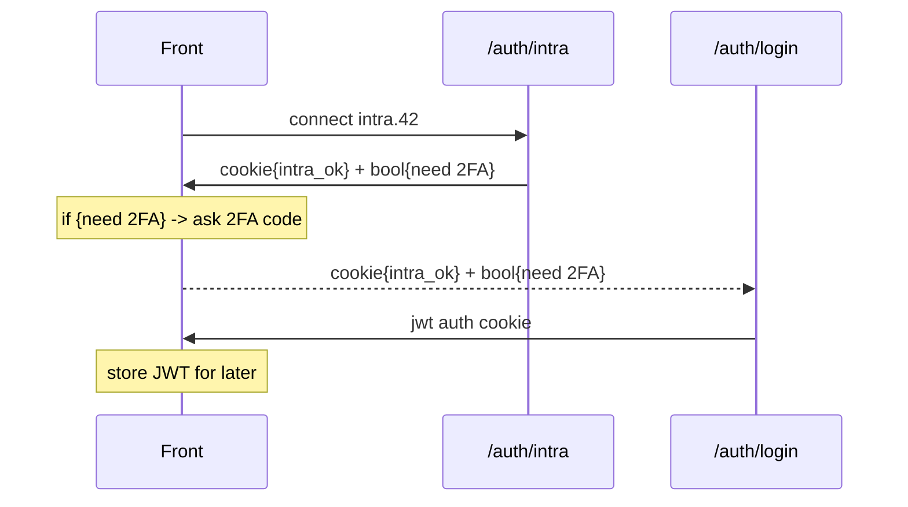

# API description
---
## Login path:

```mermaid
sequenceDiagram
    participant f as Front;
    participant ai as /auth/intra;
    f->>ai: connect intra.42
    ai->>f: cookie{intra_ok} + bool{need 2FA}
    Note over f: if {need 2FA} -> ask 2FA code
    participant al as /auth/login
    f-->>al: cookie{intra_ok} + bool{need 2FA}
    al->>f: jwt auth cookie
    Note over f: store JWT for later
```
